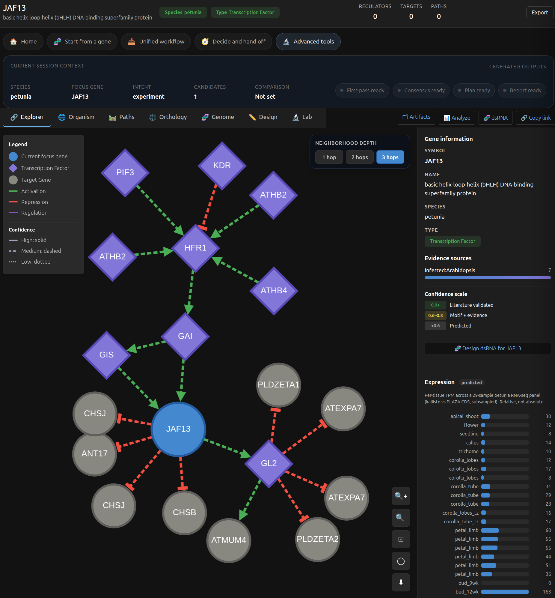
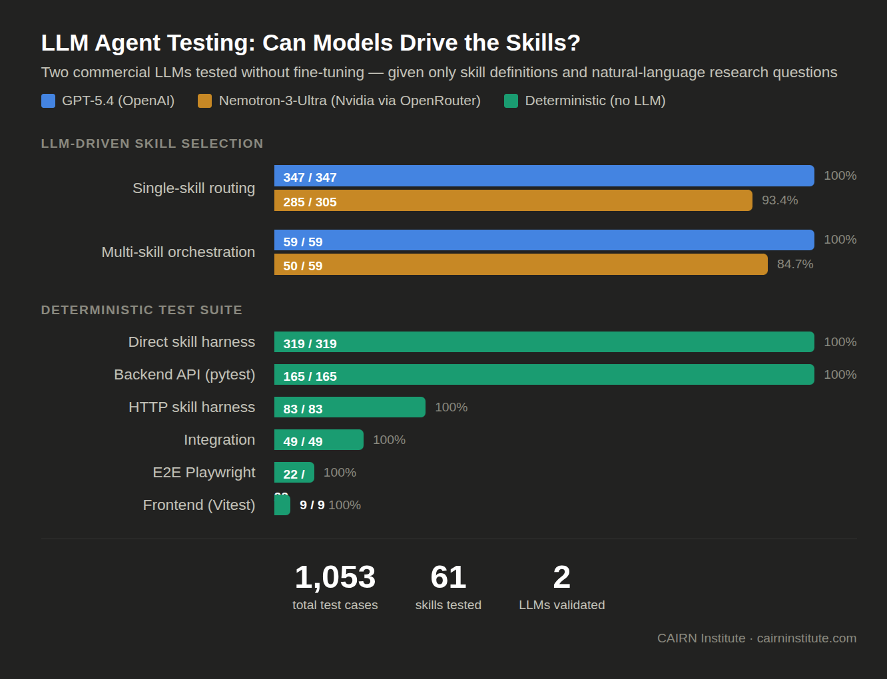

# Validation Update: New Data, Biological Benchmarking, and LLM Stress Testing in GRN Atlas

Author: CAIRN Institute

Published: August 22, 2026

Read time: 10–12 minutes

#Genomics #Bioinformatics #GeneRegulation #SystemsBiology #OpenScience #AgenticAI

## Quick Summary

Today we are publishing a validation-focused update for GRN Atlas.

Over the past week, we expanded the atlas data surface, added and hardened a large set of new research skills, and ran three different validation layers:

- direct biological validation of inferred and projected regulatory edges
- statistical validation at the network level and against independent benchmark sets
- skill and orchestration testing through both direct harnesses and external LLM-driven tool use

The current repository state is materially stronger than the initial public release:

- current species coverage is **human, mouse, arabidopsis, tomato, petunia, pepper, and potato**, with **dahlia onboarding prepared**
- the repository now contains **100 documented GRN Atlas skills** (**99 callable + 1 overview/router**)
- the current single-skill coverage audit spans **386 natural-language cases covering 100/100 skills**
- the latest full GPT-5.4 single-skill rerun is **385/386 pass**
- the latest full GPT-5.4 orchestration rerun is **111/111 pass**
- the historical completed paced Nemotron-3-Ultra expanded orchestration matrix is **79/99 pass**, with **9 retry-recovered flaky passes**
- a later Nemotron health-check rerun reached **255/258** single-skill cases and **37/40** orchestration cases before provider/model exit

Most importantly, the new validation work was not limited to software contracts. We also reran direct biological benchmarks on the network itself and completed a milestone validation suite across import, TF activity, pathway activity, chromatin support, trajectory workflows, dsRNA, CRISPR, perturbation calibration, transferability, and packaged workflow generation.

Repository: https://github.com/cairninstitute/grn-atlas

## Why This Update Matters

Many biological tools are evaluated only at the interface level.

That is not enough for a system like GRN Atlas.

If a platform claims to support regulatory-network reasoning, intervention planning, and cross-species hypothesis transfer, then three things have to be tested separately:

- whether the underlying network data are biologically plausible
- whether the statistical benchmark surfaces behave as expected
- whether the researcher-facing tools and skills can actually execute multi-step workflows correctly

This update is about method hardening. It is the difference between “the code runs” and “the scientific and workflow surfaces have been exercised directly.”

## What New Data Was Added

The atlas now spans a broader species and data surface than the initial release branch.

Current species coverage is:

- human
- mouse
- arabidopsis
- tomato
- petunia
- pepper
- potato

with dahlia onboarding prepared.

The atlas continues to combine:

- curated regulatory interactions
- inferred regulatory edges
- promoter and motif context
- orthology and transfer layers
- pathway and trait annotation
- perturbation surfaces
- RNAi / dsRNA design surfaces
- CRISPR-oriented heuristic surfaces
- importable omics, chromatin, and workflow packaging layers

At the network level, the current build includes:

- **arabidopsis:** `919,449` edges
- **tomato:** `248,288` edges
- **petunia:** `236,727` edges
- **human:** `17,946` edges
- **mouse:** `17,692` edges
- **rice:** `16,933` edges
- **potato:** `11,409` edges
- **pepper:** `2,212` edges

This is not just more data. It is a broader surface for validation, especially in plant and non-model workflows.

## Direct Validation of Inferred and Projected Regulatory Edges

One of the key questions for GRN Atlas is whether the inferred and projected edges are good enough to use as part of a defensible workflow.

We reran the direct gold-standard quality checks against the current build.

### Gold-standard edge quality

For species where we have explicit positive and negative control sets, the refreshed reports remained strong:

| Species | Recall | Specificity | Precision |
| --- | ---: | ---: | ---: |
| Petunia | 93.75% (30/32) | 100.0% | 100.0% |
| Tomato | 84.21% (32/38) | 100.0% | 100.0% |

Those numbers matter because petunia and tomato are exactly the kinds of species where a researcher is most likely to worry that projected or inferred layers are weaker than the canonical human or Arabidopsis surfaces.

### Independent benchmark validation

We also reran the independent benchmark surfaces:

| Benchmark | Result |
| --- | --- |
| Arabidopsis vs DAP-seq AUROC | 0.8801 |
| Arabidopsis vs DAP-seq AUPRC | 0.6990 |
| Arabidopsis vs DAP-seq precision@100 | 0.9000 |
| Human DoRothEA vs TRRUST AUROC | 1.0000 |
| Human DoRothEA vs TRRUST AUPRC | 1.0000 |
| Human DoRothEA vs TRRUST precision@100 | 1.0000 |

These are important for two reasons:

- they test the network against independent evidence rather than only internal consistency
- they exercise both plant and human validation paths

## Statistical Validation at the Network Level

We also regenerated the population-level network validation reports across the current species build.

Headline results:

| Species | Edges | Coherence (σ) | Multi-evidence z | Motif enrichment |
| --- | ---: | ---: | ---: | ---: |
| arabidopsis | 919,449 | 1.71 | 0.28 | — |
| tomato | 248,288 | 35.17 | 2.36 | 38.55x |
| petunia | 236,727 | 30.25 | 2.08 | 29.53x |
| human | 17,946 | 6.82 | -2.24 | — |
| mouse | 17,692 | — | 0 | — |
| rice | 16,933 | — | 0 | 27.99x |
| potato | 11,409 | — | 0 | 3.33x |
| pepper | 2,212 | — | 0 | 28.5x |

This layer is useful because it asks a different question from the gold-standard reports.

Instead of asking “did this edge match a held-out truth set?”, it asks whether the network as a population shows the kinds of structural and motif-support patterns we expect from a plausible regulatory graph.

## The New Validation Suite

Beyond the legacy validation scripts, we implemented and ran a full milestone benchmark suite under `backend/scripts/`.

The full suite completed successfully on Friday, August 21, 2026:

- suite execution status: `pass`
- scripts executed: `15`
- benchmark JSON outputs written: `12`

That means every planned validation script for the roadmap now exists and executed successfully.

### Milestone benchmark coverage

| Milestone | Area | Status |
| --- | --- | --- |
| M1 | omics import foundation | pass |
| M2a | pathway activity | pass |
| M2b | TF activity | pass |
| M3 | cell-type workflows | pass |
| M4 | chromatin layer | pass |
| M5 | trajectory workflows | pass |
| M6 | RNAi / dsRNA | pass |
| M7 | CRISPR heuristics | pass |
| M8 | perturbation calibration | pass |
| M9 | signaling → TF | pass |
| M10 | living validation dashboard | pass |
| M11 | transferability / onboarding | pass |
| M12 | workflow packaging | pass |

Summary across the 12 milestone benchmark files after rerun:

- **pass:** 12
- **partial:** 0
- **fail:** 0

## What Had to Be Hardened

The validation work did not simply confirm that everything was already correct.

Several areas needed method hardening before the suite came back clean:

- TF activity ranking behavior
- cell-type and trajectory workflow ranking
- signaling fallback behavior when direct non-TF → TF edges are sparse
- benchmark artifact schema validation
- comparator-style validation for dsRNA and CRISPR
- species threshold aggregation and validation governance artifacts

One important example was TF activity.

Earlier, the TP53-like signature benchmarks showed a failure mode where tiny perfect-overlap regulons could outrank TFs that explained more of the user’s signature. After hardening, literal TP53 recovery passed rank-1 for both `ulm` and `wmean`, while synthetic self-consistency cases still passed.

That is exactly the kind of fix that matters scientifically. It is not cosmetic. It changes whether an activity-scoring surface is trustworthy enough to be used in downstream reasoning.

## New Skills and Expanded Workflow Surface

The skill layer has expanded substantially since the earlier release state.

The repository now contains **100 documented GRN Atlas skills**:

- **99 callable analysis/workflow skills**
- **1 overview/router skill**
- the current single-skill coverage audit covers **100/100** skills across **386** prompts
- the latest full GPT-5.4 rerun passed **385/386**
- the one remaining miss from that rerun (`subgraph: TP53<->E2F1`) was fixed in a targeted follow-up rerun later on Saturday, August 22, 2026

The newer parts of the skill surface include major additions in these families:

### Omics and cell-state workflows

- `grn-omics-import`
- `grn-celltype-regulation`
- `grn-celltype-upstream`
- `grn-celltype-compare`
- `grn-trajectory-drivers`
- `grn-pseudotime-activity`
- `grn-trajectory-regulation`
- `grn-workflow`

### Chromatin and promoter-support workflows

- `grn-peak-import`
- `grn-chromatin-support`
- `grn-motif-query`
- `grn-promoter-edit-prioritization`
- `grn-variant-effect`

### RNAi and CRISPR follow-up layers

- `grn-dsrna`
- `grn-dsrna-screen`
- `grn-isoform-coverage`
- `grn-sirna-pool`
- `grn-crispr-design`
- `grn-crispr-offtargets`
- `grn-crispr-compare`
- `grn-primer-design`

### Validation, calibration, and decision-support workflows

- `grn-perturbation-import`
- `grn-perturbation-calibration`
- `grn-transfer-risk`
- `grn-family-rescue`
- `grn-species-onboarding-status`
- `grn-benchmark-status`
- `grn-validation-plan`
- `grn-study-packet`
- `grn-study-report`

These additions matter because they push the system beyond static network browsing into import-first analysis, assay-oriented follow-up, and collaborator-facing handoff workflows.

*A regulatory-network view in GRN Atlas showing signed edges, confidence encoding, gene metadata, and expression context. The same atlas surfaces validated in the benchmark suite are also exposed interactively in the UI and through the skill layer.*

## Single-Skill Testing

The single-skill story is now broader than the older baseline matrices.

There are two relevant views of single-skill testing in the repository:

### 1. Direct skill execution harness

This is the most literal check of whether each skill runs correctly through its own `scripts/run.py` entrypoint against the backend.

Current result:

- **90/90 skills passing**

### 2. Natural-language single-skill coverage inventory

This asks a different question: if a model receives a natural-language request, do we have routing cases that exercise the full skill surface?

Current inventory:

- **376 natural-language single-skill cases**
- **90/90 skills covered**

Historically, the clean baseline GPT-5.4 single-skill matrix remains:

- **347/347 pass**

The later expansion work added supplemental coverage to reach the current 376-case inventory and full 90-skill surface coverage.

## GPT-5.4 Orchestrator Testing

The strongest current orchestration result in the repository is the expanded GPT-5.4 matrix.

Current result:

- **99/99 pass**

This expanded orchestration layer includes:

- import → contrast → upstream and trajectory chains
- CRISPR design plus promoter and motif follow-up
- inferred-edge validation against module structure
- pathway activity plus phenotype or trait interpretation
- conservation plus transferability plus family-rescue chains
- phenotype-targeting plus validation-plan handoff

In practical terms, GPT-5.4 is now clean on the full expanded workflow surface currently represented in the repository.

## Nemotron-3-Ultra Orchestrator Testing

We also ran the same expanded workflow surface through Nvidia Nemotron-3-Ultra via OpenRouter, with slower pacing to reduce avoidable provider noise.

Paced expanded run result on Saturday, August 22, 2026:

- **79/99 pass**
- **20 persistent fails**
- **9 retry-recovered flaky passes**

This is still useful. It tells us two things at once:

- the skill layer is portable enough that a weaker external orchestrator can still complete a large share of the workflow surface
- the hardest workflow families are now clearly identified

### Nemotron fail families

The persistent fail set clustered into a few clear groups:

| Family | Questions | Pattern |
| --- | --- | --- |
| Comparison under-chaining | Q3, Q24 | partial retrieval without completing overlap, gene-info, or enrichment follow-up |
| Phenotype-first petunia planning and ranking | Q36, Q50, Q54, Q81, Q83 | candidate discovery happened, but ranking, RNAi framing, or validation handoff was weak or incomplete |
| Intervention tradeoff / capability boundary | Q53, Q56 | model touched the right surface but did not complete the required planning synthesis |
| Cross-species transfer / family-rescue synthesis | Q40, Q67 | weak transferability framing, sometimes compounded by provider overload |
| Motif / promoter / edit planning | Q43, Q78 | started the motif side of the workflow but did not finish the full promoter/edit interpretation |
| Import-first returned-id workflows | Q65, Q66, Q71, Q77 | hardest current family for Nemotron |
| Decision-boundary / calibration / counterfactual synthesis | Q60, Q72, Q76 | the right tools were partially called, but the final structure was not satisfied |

The paced run also surfaced a few real chain-path issues that are not merely model weakness:

- Q66 exposed a real `grn-omics-import` runtime error
- Q76, Q77, and Q78 surfaced HTTP 404 workflow-path failures

That is useful signal. It means the Nemotron stress pass did not just grade the model. It also helped expose hardening targets in the workflow layer itself.

*Current external-orchestrator summary: GPT-5.4 is clean on the expanded orchestration matrix, while Nemotron remains useful as a portability and hardening probe that exposes weak families in phenotype-first planning, import-first chaining, and decision-boundary synthesis.*

## What This Update Says About GRN Atlas Today

After the past week of work, the evidence is materially stronger in four different ways.

### 1. The atlas data surface is broader

The project now spans a larger multi-species network surface, including newer crop and ornamental-supporting builds beyond the original five-species emphasis.

### 2. The inferred and projected regulatory layers are benchmarked directly

We are not only asserting that the network is biologically useful. We refreshed the gold-standard quality reports, reran independent AUROC/AUPRC benchmarks, and regenerated the population-level network validation reports.

### 3. The workflow layer is substantially deeper

Import-first omics workflows, chromatin-aware follow-up, calibration surfaces, CRISPR comparison, onboarding readiness, and collaborator-facing packaging are now part of the validated surface.

### 4. The LLM testing is now a real stress surface

The system is no longer being tested only on isolated prompts. It is being tested on direct skill execution, natural-language skill routing coverage, full GPT-5.4 orchestration, and paced Nemotron orchestration on the harder chain families.

## Practical Bottom Line

The most defensible current public statement is:

- GRN Atlas is no longer just a network browser
- it is a multi-layer research system with direct biological benchmarking, statistical validation, and explicit workflow-level testing
- the strongest current clean orchestrator result is GPT-5.4 at **99/99**
- Nemotron remains useful as a stress-test model, but it is materially less reliable on the hardest chained workflows

For academic and non-commercial use, the project is publicly available now.

For commercial use, productization, hosted deployment, or partnership discussions, contact CAIRN Institute.

## Source Documents Behind This Update

This update is grounded in the current in-repo validation and testing artifacts, including:

- `docs/validation_summary_2026-08-21.md`
- `docs/validation_run_summary_2026-08-21.md`
- `docs/post_release_hardening_execution_2026-08-21.md`
- `docs/skill_test_results_2026-08-21.md`
- `docs/llm_skill_orchestration_coverage_matrix_2026-08-21.md`
- `docs/llm_testing_workflow_coverage_2026-08-13.md`
- `docs/llm_model_comparison_release_notes_2026-08-14.md`

## Closing

The point of this week’s work was not just to add features.

It was to make the platform more defensible.

That means better data, more explicit validation, stronger assay-oriented workflows, broader direct testing, and clearer understanding of which LLM-driven workflow families are robust today and which still need hardening.

That is the standard we want GRN Atlas to meet as a research platform.
